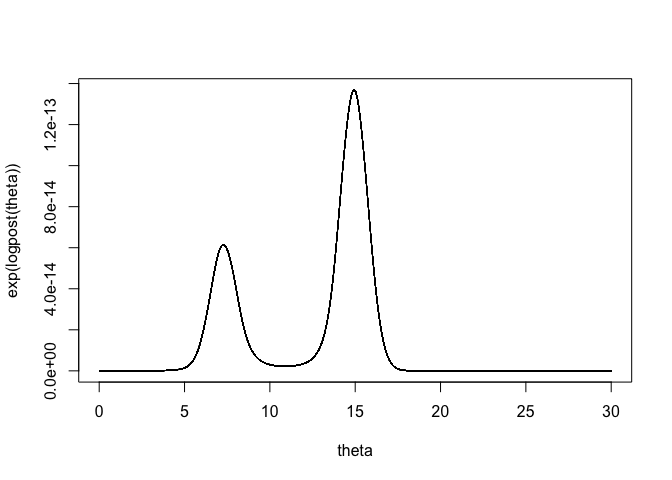
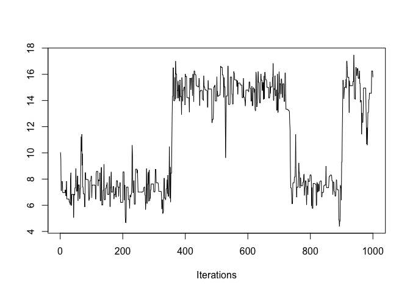
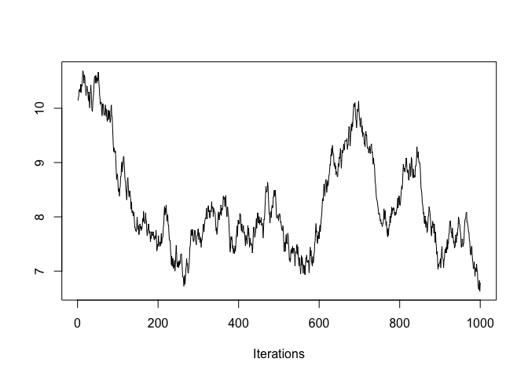
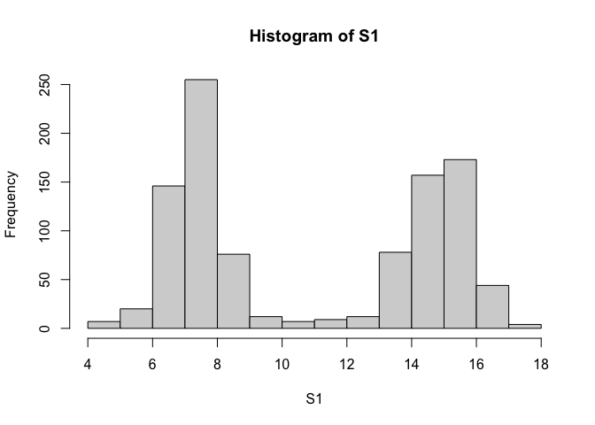
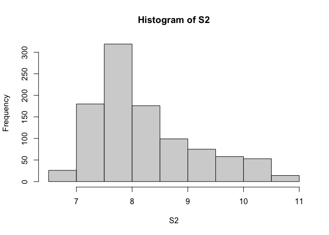
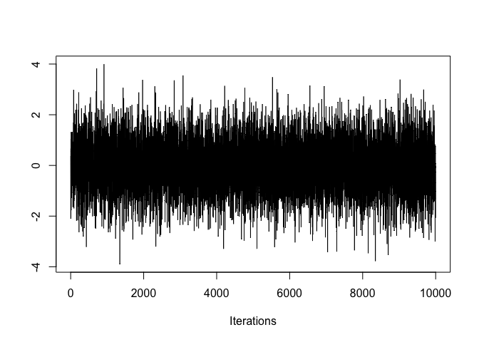
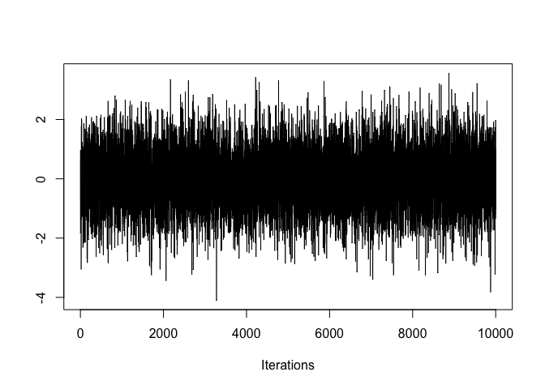
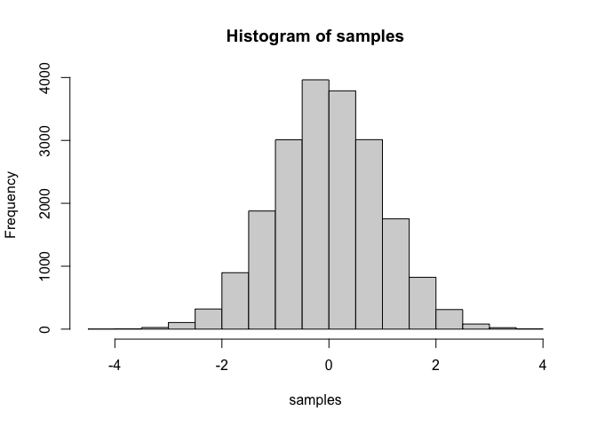

Markov Chain Monte Carlo Simulation
================
Dec 8, 2022


# We can generate Markov Chain Monte Carlo Samples to approximate any posterior distribution without having to know its normalizing constant.

# Here, we approximate the bimodal Cauchy Distribution with arbitrarily set values

``` r
set.seed(10)

# We will find the log posterior
logpost = function(theta){
  y <- c(3, 6, 7, 8, 15, 14, 16, 17)
  log_likelihood <- 0
  
  for (i in 1:length(y)){
    log_likelihood = log_likelihood + log((1 / (pi * (1 + (y[i] - theta)^2))))
  }
  
  return(log_likelihood)
}
```

# Cauchy Distribution

``` r
theta <- seq(0, 30, by = 0.0001)
plot(theta, exp(logpost(theta)), type = 'l')
```

<!-- -->

#### Metropolis-Hastings Function Implementation

``` r
metropolis <- function(logpost, current, C, iter){
  S <- rep(0, iter)
  theta_t <- current
  
  for(j in 1:iter){
    # Proposal Distribution
    theta_p <- runif(1, theta_t - C, theta_t + C)
    
    ## Log-rejection ratio for symmetric proposal
    logr <- log(min(1, exp(logpost(theta_p)) / exp(logpost(theta_t))))
    
    # Reject/Accept proposal state
        if (log(runif(1,0,1)) < logr){
      theta_t <- theta_p
        }
    
    # Save in our S
    S[j] <- theta_t
    
    }
  return(S)
}
```

# Making traceplots to deterine how our Metropolis-Hastings MCMC samples look:

``` r
library(coda)

# Traceplot for S1
coda::traceplot(as.mcmc(S1))
```

<!-- -->

``` r
# Traceplot for S2
coda::traceplot(as.mcmc(S2))
```

<!-- -->

By inspecting the traceplot for S1 (C = 3) and S2 (C = 0.2), we can see
that our C = 3 is a better approximation of our posterior because we
lead to a stationary distribution at either of the two areas where we
have the highest height in our Cauchy distribution. However, S2
constantly changes and is still not stationary even after the 1000th
iteration. Thus, S1 is the better approximator.

``` r
hist(S1)
```

<!-- -->

``` r
hist(S2)
```

<!-- -->

Looking at the histogram, we can see that our S1 histogram looks very
similar to our Cauchy Distribution since they are both bimodal which
makes sense since we’re generating samples for it, while our S2 does
not. Hence, we can say that S1 or C=3 better approximates our
distribution.

# We will now implement the Gibbs sampling MCMC method

``` r
gaussian_gibbs = function(burn_in, keep_draws, theta0, rho){
theta_sample = matrix(0, nrow = 1+ burn_in + keep_draws, ncol = 2)
theta_sample[1,1] = theta0[1]
theta_sample[1,2] = theta0[2]
for(i in 2:(burn_in + keep_draws)){
  theta_sample[i,1] = rnorm(1, rho * theta_sample[i-1,2], sqrt(1-rho^2))
  theta_sample[i,2] = rnorm(1, rho * theta_sample[i,1], sqrt(1-rho^2))
}
theta_sample_out = theta_sample[(2+burn_in):(1+ burn_in + keep_draws), ]
return(theta_sample_out)
}
```

# Making traceplots to deterine how our Gibbs MCMC samples look:

``` r
# traceplot from our gibbs sampling
gibbs <- gaussian_gibbs(1000, 10000, c(0,0), 0.6)
coda::traceplot(as.mcmc(gibbs))
```

<!-- --><!-- -->

``` r
hist(gibbs)
```

<!-- -->

We can see that the traceplots for both theta 1 and theta 2 converges
since stays in the general vicinity of 0 and looks horizontal for both
traceplots after the burn-in period. Our histogram shows that we follow
a normal distribution, which is true of the joint posterior since a
normal-normal gives us a normal posterior, so the graph makes sense.

``` r
# traceplot from our rmvnorm samples
cov <- matrix(c(1,0.6,0.6,1), nrow=2, ncol=2, byrow = T)

samples <- mvtnorm::rmvnorm(n=10000, mean=c(0,0), sigma=cov)
coda::traceplot(as.mcmc(samples))
```

<!-- --><!-- -->

``` r
hist(samples)
```

<!-- -->

The samples from our rmvnorm look very similar with our gibbs sampling
traceplots. The histogram of our samples resembles a normal distribution
and our gibbs sampling.
